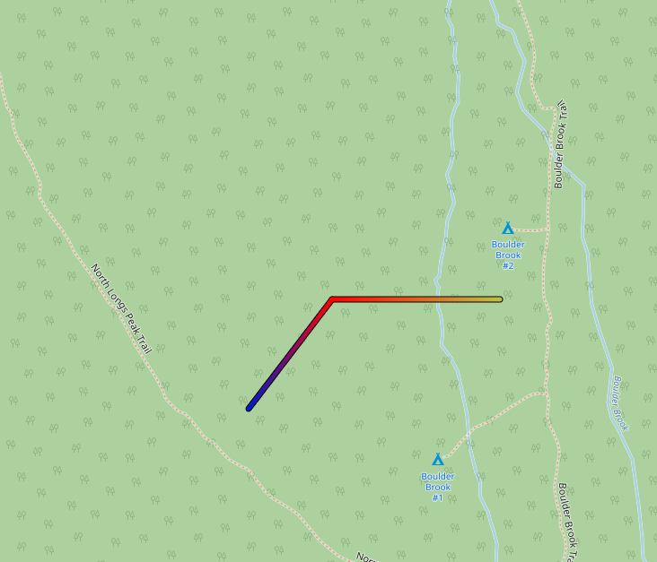

# leptos-leaflet-hotline
This is a personal project for creating polylines with color gradients using Rust, Leptos and Leaflet.  It is currently functional, but not all details have been implemented.  

# Note
This project is primarily based the following other projects. 
- The existing hotline extension for leaflet-js: [iosphere/Leaflet.hotline](https://github.com/iosphere/Leaflet.hotline/blob/master/LICENSE), Bindings are created using `wasm-bindgen`.

- The leptos-leaflet repository: [leptos-leaflet](https://github.com/headless-studio/leptos-leaflet/blob/main/LICENSE).  This project adapts the structure from that project to create hotline components in leptos-leaflet.  

- like the above projects, this is also based on leaflet: [leaflet](https://github.com/Leaflet/Leaflet/tree/6ee30226c8270d8bdaec0a14c4018f244c7f5e59)


## Project Structure
```
examples
|_ssr-example (code to serve an example on localhost:3000 using Axum)
leptos-leaflet-hotline
|_src (source code for the project)
```
The exeample is set up using the Leptos Axum template and contains a README with additional description.

## Usage

To add a hotline to a map, use the `HotPolyline` component.  The `positions` and `palette` props define the path and palette for the color gradient, respectively. As in `leaflet-hotline`, the values being visualized along the path are specified in the third element of each position (i.e., `positions` is an array of `(lat, lng, value)` tuples).  At some point I want to change this so the values do not have to be part of the latlng data type, but that would require a fair amount of decoupling from the existing JS bindings and will take some time.

e.g., 
```
<HotPolyline
    positions=hotline_positions(&[(40.2928, -105.6180, 56.54), (40.2928, -105.6190, 6.80), (40.2928, -105.6200, 96.52), (40.2918, -105.6210, 24.91)])
    palette=hotline_palette(&[("green", 0.0), ("blue", 0.33), ("#ffff00", 0.67), ("red", 1.0)])
/>
```

## Screenshots

A hotline with randomly generated values along the path.




